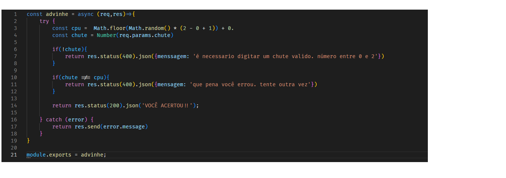
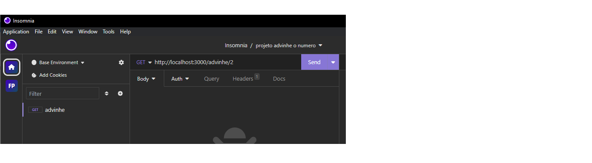

# Desafio de carreira do M02 da  [Cubos Academy](https://cubos.academy/)

## Advinhe-o-numero
### É um jogo simples de advinhação, onde o usuário/cliente da API irá requisitar um número entre 0 e 2, logo após isso é impresso na tela o resultado.

### Controlador de rota

### Para que consiga rodar o projeto, é necessário instalar o express e o nodemon. Para isso basta que rode o seguinte comando no terminal.

`npm run start`

### A entrada deve ser feita atravez do Protocolo de Transferência de Hipertexto ou http/url a seguir:

`http://localhost:3000/advinhe/` <- depois da / você devecolocar o seu palpite: numero entre 0 e 2.

utilizei o insomminia para rodar o jogo. 

### Divirta-se 🙈🙉
